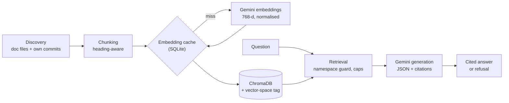

# Second-Brain Search

A command-line tool that answers questions about my own software projects, using their
documentation and commit history. Every answer cites the file or commit it came from, and
when nothing it finds answers the question, it says so instead of guessing.

**Why:** I kept forgetting how I'd solved things across my own projects.
**Stack:** Python, Gemini embeddings + generation, ChromaDB, Click, MCP, pytest.
**Status:** Feature-complete; in polish/freeze.

## Example

An answer, from a run on 2026-10-04:

```text
> sbs ask "How did I fix the IDOR in DSA Tracker's submitReview?"
You fixed the authorization vulnerability in submitReview by verifying that the problem
actually exists and belongs to the authenticated user using Prisma, throwing an
unauthorized error if it does not.

Sources:
  [1] DSA Tracker / commit b237453 > security: Fix submitReview authorization vulnerability by verifying problem ownership  (committed 2026-07-02)

gemini-3.5-flash-lite - 10 passages retrieved, 1 cited
```

No document mentions that fix; only the commit message records it, which is why git
history is indexed alongside the docs.

A refusal, from a run on 2026-10-03 (passage snippets trimmed):

```text
> sbs ask "How did I set up Kubernetes deployment?"
No answer in your documentation for: "How did I set up Kubernetes deployment?"

Closest passages (not an answer):
  1. [0.64] Interview Flashcards / README.md > Interview Prep Flashcards > Deployment
  2. [0.64] Watch Tracker / README.md > watch-next > Deploying it
  3. [0.63] Watch Tracker / README.md > watch-next > Status

gemini-3.5-flash-lite - 10 passages retrieved, 0 cited
```

## Features

- **Two sources.** Each project's documentation (READMEs, CLAUDE.md, specs, changelogs, `docs/`)
  and its git history. Only the owner's own commits are indexed. A commit with a thin message
  also gets a short, filtered diff excerpt.
- **`sbs search`** returns the most relevant passages, each cited as `Project / location`.
- **`sbs ask`** gives an answer with numbered citations, or a refusal that shows the closest
  passages so you can check it.
- **`sbs eval`** is a retrieval eval suite with fact-level checks and no-answer traps.
- **`sbs-mcp`** is a local stdio MCP server that gives Claude Code and Claude Desktop read-only
  `list_projects` and `search` tools. Claude writes the answer itself; the server generates
  nothing.

Corpus: ≈1,750 chunks across 17 projects, ~899 of them from commits (measured 2026-10-07).

## How it works



1. **Discovery** scans one parent folder (`SBS_SCAN_ROOT`) for target doc files and skips
   dependency and build directories. Git history is read from each repo's default branch as last
   fetched, or from local `HEAD` when the repo has no remote. Indexing never fetches.
2. **Chunking** splits each doc at its headings, then caps each chunk at 1,500 characters with a
   150-character overlap. Chunks under 50 characters are dropped. The heading path is prefixed
   to the embedded text, so a chunk deep inside a section still carries that section's topic.
3. **Embedding** uses `gemini-embedding-001` at 768 dimensions. At that size the API returns
   vectors that aren't unit length, so they're normalised before storage. Vectors are cached
   by model, dimensions, task type and a hash of the text, so unchanged text is never
   embedded twice.
4. **Storage** is a local ChromaDB collection. It records which vector space built it.
5. **Retrieval** refuses before spending any quota if the index was built with a different
   embedding model. `ask` ranks a pool of 40 candidates, then keeps up to 10, with at most
   3 per file and 5 per project, so one long document can't fill the context.
6. **Generation** sends the passages to Gemini fenced as data and gets JSON back. Each citation
   is resolved to its source and dated, by its git commit date with the file's modification time
   as a fallback.

## Setup

Requires Python ≥3.11 (tested on 3.12). Developed and tested on Windows.

```powershell
python -m venv .venv
.venv\Scripts\activate
pip install -e ".[dev]"
copy .env.example .env
```

`.env` (gitignored):

| Variable | Required | Purpose |
|---|---|---|
| `SBS_SCAN_ROOT` | yes | Absolute path to the folder that holds all your project repos |
| `GEMINI_API_KEY` | for `index`, `search`, `ask`, `eval`, and MCP `search` | Not needed for `discover`, `index --dry-run` or MCP `list_projects` |
| `SBS_GENERATION_MODEL` | no | Default `gemini-3.5-flash-lite`; the fallback is `gemini-3.6-flash` |

Settings are applied in this order, each overriding the last: code defaults, `config.toml`
(committed), `config.local.toml` (gitignored, overrides key by key), then the environment.
Personal values belong in `config.local.toml`:

```toml
[git]
# Only commits by these authors are indexed. With [git] enabled and both lists
# empty, `sbs index` refuses to run.
author_emails = ["you@example.com"]
author_names = ["Your Name"]

[mcp]
# Projects the MCP server hides. [] hides nothing; if this key is unset,
# sbs-mcp refuses to start.
exclude_projects = ["<private-project>"]
```

## Commands

```powershell
sbs discover                     # list the doc files that would be indexed (no API key)
sbs discover --json
sbs index --dry-run              # chunk counts and how many texts need embedding; no key, no writes
sbs index                        # full rebuild; cached vectors are reused
sbs search "rate limiting" -k 5 --project "Watch Tracker"
sbs ask "How did I fix the IDOR in DSA Tracker's submitReview?" --show-context
sbs eval                         # writes data/eval/retrieval-v2-<timestamp>.json
```

- `search`: `-k` 1–50, default 5. `--project` matches the project name in any case.
- `ask`: `-k` 1–50, default 10; `--project`; `--show-context` also prints every passage retrieved.
- `eval`: `--fixture` (default `eval/retrieval_v2.toml`), `--out`, `-k` (default 10).

Cost per command: `search` uses 1 embedding, `ask` uses 1 embedding plus 1 generation, and
`eval` uses 1 embedding per question.

### MCP server (`sbs-mcp`)

`sbs-mcp` exposes two tools: `list_projects` (free) and `search` (`k` up to 20, 1 embedding
per call). Each session allows `[mcp] max_searches` searches, 50 by default. Replace `<repo>`
with this repository's folder.

Claude Code, available in every project:

```powershell
claude mcp add second-brain --scope user -- "<repo>\.venv\Scripts\sbs-mcp.exe"
```

Check it with `claude mcp list`. Don't use `--scope project`, which writes the absolute path
into a committed `.mcp.json`.

Claude Desktop: open Settings → Developer → Edit Config and merge this into
`claude_desktop_config.json`, keeping the keys already there. Then quit Desktop from the system
tray and start it again.

```json
"mcpServers": {
  "second-brain": { "command": "<repo>\\.venv\\Scripts\\sbs-mcp.exe", "args": [] }
}
```

No `env` block is needed. The server finds `.env` and the config files from its own install
location.

## Design decisions

- **Pacing to the free tier.** These limits are for `gemini-embedding-001`, as read from AI
  Studio on 2026-09-18: 100 texts/minute, 30,000 tokens/minute, 1,000 texts/day. A batch closes
  at 100 texts or 12,000 estimated tokens, and one batch is sent per minute. Neighbouring batches
  count against the same window, so back-to-back batches stay at or under 80% of the token limit.
  A per-day 429 fails fast instead of retrying, since waiting can't help.
- **Embedding cache plus a safe rebuild.** Each batch is saved to an SQLite cache as soon as it
  returns, so a run that hits the daily quota resumes the next day without re-embedding. Every
  vector is in hand before the index is reset, so a failed run leaves the previous index intact.
- **Own commits only.** Commits are kept only when they match the configured author emails or
  names. Merges and pure version bumps are skipped.
- **Filtered diff excerpts.** A thin commit gets up to 800 characters of its diff. Lockfiles,
  images, binaries and env files are left out, and any line matching one of five secret
  patterns is dropped whole rather than partly redacted. The patterns are Google API keys, PEM
  private keys, `key/secret/password/token = value`, credentials in URLs, and bcrypt hashes.
- **Refusal first.** The model is told to answer only from the passages and to refuse
  otherwise. An answer that cites no passage it was actually given is turned into a refusal,
  and its text is discarded.
- **Eval scoring stays inside the expected projects.** Once git history was indexed, this
  repo's own eval commits quoted the strings the eval looks for. A text match therefore counts
  only in a passage from one of the question's expected projects.

## Evaluation

`eval/retrieval_v2.toml` holds 14 questions. Each one is scored by a single check:

- **text:** a top-k passage from an expected project must contain a given string. Used for facts.
- **project:** every expected project must appear in the top k. Used for "which of my projects…"
  questions.
- **no answer (trap):** nothing in the corpus answers it. It isn't scored; whether `sbs ask`
  refuses it is checked by asking.

The latest report (2026-10-03, k=10) has **11 of 11 scored questions passing**: text 7/7 and
project 4/4. The 3 traps were refused by `sbs ask` on 2026-10-03. The eval measures retrieval,
not whether a generated answer is correct.

## Known limitations

- **Gemini's free tier.** Gemini's free-tier inputs may be used to improve Google's products and
  read by human reviewers; see the [Gemini API terms](https://ai.google.dev/gemini-api/terms).
  Projects listed in `[mcp] exclude_projects` are hidden from the MCP server, but `sbs index`
  still embeds them and `sbs ask` can send their passages for generation.
- **Mid-word cuts.** The overlap between split chunks can start a passage mid-word.
- **Near-empty chunks.** A chunk such as a section that is only `npm install` can take a
  retrieval slot.
- **Short contexts.** Capped retrieval never tops passages back up, so a question naming a
  large project can end up seeing only that project's passages. One trap, q13, had its
  cross-project lure crowded out this way, so it hasn't yet tested whether the model resists a
  plausible passage from another project.
- **Rebuilds only.** Every `sbs index` is a full rebuild, with no incremental updates or file
  watching.
- **Shelved for lack of a failing case:** code-aware chunking, and lifting the per-file cap
  under `--project`.

## Tests

```powershell
pytest
```

560 tests: 559 offline with fakes + 1 opt-in live Gemini test (runs only when `GEMINI_API_KEY`
is set; costs 1 embedding). The live test checks the environment variable only, not `.env`. To
skip it, run with the key unset:

```powershell
$env:GEMINI_API_KEY = ""; pytest
```
